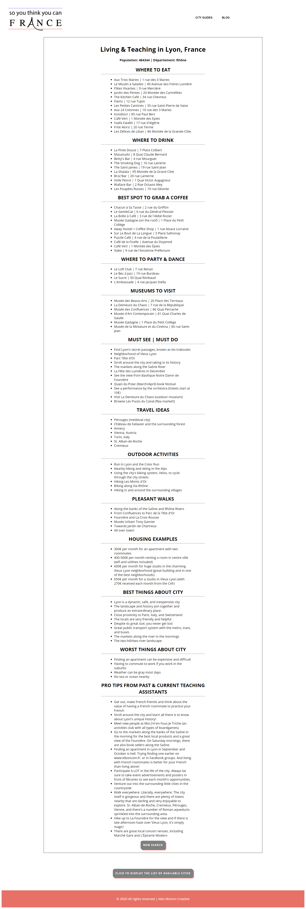

# So You Think You Can France

### Created and developed by [Alex Morton](https://alexlsalt.github.io/)  

So You Think You Can France is my latest rebuild of a website I previously built in 2016 when I was teaching English in a French high school as part of the Teaching Assistant Program in France (TAPIF). It's a resource for other American teachers in France and includes information on different cities and villages around France - gathered from past teaching assistants, themselves.

Built using React (front-end), Firebase Firestore (database). Deployed with Netlify.

## About

From 2016 to 2018, I worked as an Assistante d'anglais (English assistant) in a French high school classroom through the TAPIF program (Teaching Assistant Program in France). It was an amazing way to be able to get a taste of living and working abroad in France, and it ended up being the first chapter of my life as an American in France.

As I was going about my time as an English assistant, I became increasingly aware of the fact that there was so much ambiguity around the entire process of applying for a spot in the TAPIF program, as well as actually moving abroad and figuring things out. 

From there, the idea of So You Think You Can France was born as a resource for current and future teaching assistants in France to use before and during their time abroad!


### How it works

[View a live demo >>](https://www.loom.com/share/8aa47e80137e40cca785d9c74a4db2d8)

The main feature of the app itself are the city guides of various French cities. Over the course of my time as a teaching assistant, I was able to source hundreds of assistants' experiences in their own respective host cities through a Google form and TAPIF Facebook groups. 

From there, I built out pages of French city guides with the following categories:

- Where to Eat (Restaurants)
- Where to Drink (Bars)
- Best Spot to Grab a Coffee (Cafes and Coffeeshops)
- Where to Party & Dance (Nightclubs)
- Must See | Must Do
- Travel Ideas
- Outdoor Activities
- Pleasant Walks
- Housing Examples (apartment rental prices)
- Best & Worst Things About City
- Pro-Tips from Past & Current Teaching Assistants

All of the data is stored in Firebase Firestore, and each time a user inputs a French city to search, the app makes a call to the database to fetch each category's information. If the category is empty (i.e. no restaurants in a specified city are listed within the restaurant collection, the restaurant section of the city guide is not rendered).

## Features 

The app itself is made up of a City Guide search functionality and a Blog. (Note: Blog is still under construction)

The main City Guide SearchBox component is where of the of app's state can be found. I'm still working through consolidating all of the useState hooks (there are quite a few), but so far, this gets the job done, functionally.

Once a user inputs a city to search for (i.e. Lyon), the app makes a call to the connected database on Firebase Firestore to search through the 'Cities' collection. If there is indeed a City document where `city.name` is equal to the user's input, a City Guide Template will render and each of the subsequent categories will be filled in if there is data to be rendered. 

```
const handleSubmit = (event) => {
    event.preventDefault();

    db.collection("cities")
      .where("name", "==", text)
      .get()
      .then((snapshot) => {
        setShowTemplate(true);
        const data = snapshot.docs.map((doc) => doc.data());
        const city = data[0];
        setCityInfo({
          population: city.population,
          departement: city.departement,
          mustSee: city.mustSee,
          travelIdeas: city.travelIdeas,
          outdoorActivities: city.outdoorActivities,
          walks: city.walks,
          housingExamples: city.housingExamples,
          bestThings: city.bestThings,
          worstThings: city.worstThings,
          proTips: city.proTips,
        });
      })
      .catch((error) => {
        setText('Enter a French city');
        setShowTemplate(false);
        alert(`Please make sure your search entry is capitalized 
        corrrectly (i.e. Toulouse or Aix-en-Provence). Otherwise, it's possible 
        that there isn't a city guide for ${text} yet.`);
        }
      );
```


## Ongoing considerations 

### - Consolidating useState hooks (possibly look in to useReducer)

At the moment, I have a lot of state to keep track of, and I suspect there could be a better way to do so. In the SearchBox component, here's what that looks like: 

```
export default function SearchBox() {
  const [text, setText] = useState("Enter a French city");

  const [cityInfo, setCityInfo] = useState({
    name: text,
    population: null,
    departement: null,
    mustSee: [],
    travelIdeas: [],
    outdoorActivities: [],
    walks: [],
    housingExamples: [],
    bestThings: [],
    worstThings: [],
    proTips: []
  });

  const [restaurants, setRestaurants] = useState([]);
  const [bars, setBars] = useState([]);
  const [cafes, setCafes] = useState([]);
  const [nightclubs, setNightclubs] = useState([]);
  const [museums, setMuseums] = useState([]);

  const [cityList, setCityList] = useState([]);

  const [showTemplate, setShowTemplate] = useState(false);
```

I'd like to explore the useReducer hook a bit more to see if this can be improved.

## Sample City Guide - Lyon


